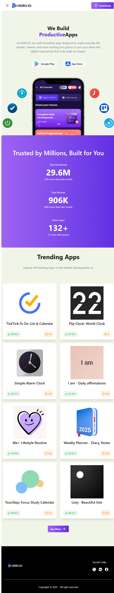

# Website Screenshot

  

# Productivity Apps Showcase Platform

A modern web platform for discovering, comparing, and exploring productivity-focused mobile applications. This project highlights real-world app metrics such as ratings, downloads, and reviews, helping users make informed decisions quickly and easily.

---

## 📌 Project Overview

The Productivity Apps Showcase Platform is designed to present a curated collection of productivity applications including to-do lists, time planners, and tracking tools. Each app is displayed with detailed information such as average ratings, total downloads, number of reviews, app size, and developer name.

The platform emphasizes performance, clean UI, and scalability, making it suitable for handling large datasets while maintaining a smooth user experience.

---

## ✨ Features

- 📱 App listings with icons, titles, and developer names
- ⭐ Average ratings and total review counts
- 📥 Download statistics for popularity insights
- 🔍 Search functionality to find apps easily
- 📊 Sorting by rating and download count
- 📄 Pagination for large datasets
- ⚡ Fast and responsive UI across all devices

---

## 🛠️ Technology Stack

### Frontend

- **React.js** – Component-based architecture for dynamic UI rendering
- **Tailwind CSS** – Utility-first CSS framework for responsive design
- **TanStack Query (React Query)** – Efficient data fetching, caching, pagination, and sorting
- **React Icons** – Lightweight and scalable icon library

### Backend

- **Node.js** – JavaScript runtime for building scalable server-side applications
- **Express.js** – RESTful API framework for handling routes and middleware

### Database

- **MongoDB** – NoSQL database used to store app data such as ratings, downloads, reviews, and metadata
- Optimized queries for search, sorting, and pagination

### Other Tools

- **Axios** – Promise-based HTTP client for API communication
- **Image Hosting (imgbb)** – External service for storing and serving app icons

---

## 📂 Sample Data Structure

Each application in the database includes the following fields:

- App title and icon
- Developer / company name
- Average rating and total reviews
- Total downloads
- App size
- Description and ratings breakdown

This structure allows efficient filtering, sorting, and display of real-world app metrics.

---

## 🚀 Why This Project

This platform goes beyond a basic app listing by focusing on meaningful productivity metrics. Users can quickly compare apps based on popularity and user satisfaction, while developers benefit from a scalable and maintainable architecture.

The project is ideal for showcasing full-stack development skills, including frontend UI design, backend API development, and database optimization.

---

## 📄 License

This project is open-source and available for learning, customization, and portfolio use.

---

## 👨‍💻 Author

Developed as a full-stack project demonstrating modern web technologies and best practices.
